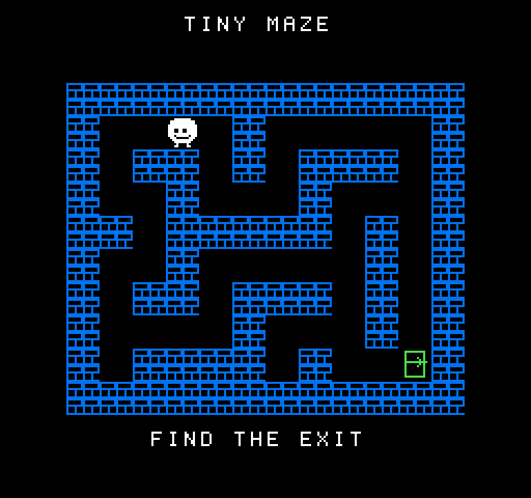

# NES Maze：原创可玩迷宫

这个示例把原创 NROM-128 游戏和固定 NES CPU/PPU 核心编译进独立 Wasm 包。6502 ROM 读取 `$4016` 控制器、检查墙壁、移动玩家、判断胜利并通过 PPU 写入画面；guest 负责触摸按键、分片执行和提交完整像素帧。无声音、无商业 ROM 或外部素材。

## 玩法

等待 `TINY MAZE / PRESS START` 画面，点击右下方 `START`。使用底部 `UP`、`DN`、`<`、`>` 逐格移动白色角色，到达右下角绿色出口后显示 `YOU WIN`。`RESET` 随时重开；顶部宿主返回键退出应用。

每次触摸释放产生一个方向脉冲。按键持续一个完整模拟帧，随后释放一帧，重复点击同方向可以重复移动。执行过程中只缓存一个后续输入，队列已满时忽略多余点击。这个触摸界面不提供长按连走。



上图是 native 模拟器输出的 RGB565 帧，放大三倍方便查看；不是设备截图。实际设备帧率与触摸延迟以产品板测记录为准。

## 一条命令构建和签名

从 SDK 根目录执行，使用现有 Zig 0.13.0 与安装了 `cryptography` 的 Python：

```powershell
python examples/nes-maze/build.py --cc <zig路径> --development-key --key-id 1
```

生成 `examples/nes-maze/build/maze.nes`、`nes-maze.wasm` 和 `nes-maze.trpkg`。开发签名键是公开测试键，目标设备必须明确配置为信任该 key_id；正式发布使用 `--private-key <P-256私钥.pem> --key-id <发布者ID>`。构建会校验固定上游源码、生成原创 ROM 和受控 CPU 分派，再调用统一包工具；不下载、不安装全局工具。

也可只构建 Wasm，然后使用统一工具签名和校验：

```powershell
python examples/nes-maze/build.py --cc <zig路径>
python tools/tinyrt.py pack examples/nes-maze --wasm examples/nes-maze/build/nes-maze.wasm --output examples/nes-maze/build/nes-maze.trpkg --key-id 1 --development-key
python tools/tinyrt.py validate examples/nes-maze/build/nes-maze.trpkg --key-id 1 --development-key
```

`validate` 校验包封装和签名；实际 Wasm 导入、内存、指令预算及执行由真实 WAMR 测试和宿主验证。这个例子使用私有 `build.py`，公共 `tinyrt.py build` 不负责 ROM/第三方核心生成。

## 宿主要求和范围

- 包 ABI 1，permissions=11（DRAW、TOUCH、CLOCK），memory_pages=16，回调预算100000；线性内存初始256 KiB、最大1 MiB，WAMR 执行栈仍为8 KiB。
- 需要可选 `draw_rgb565`、`draw_skip`、`clock_interval` 导入。旧宿主会因不支持导入拒绝此包；ABI 1 的其他旧应用继续使用既有接口。
- 请求1 ms时钟间隔，每次事件最多推进64条扫描线，其中需要CPU解释或背景绘制的扫描线最多3条，到完整帧立即返回。未完成新帧时 `draw_skip()`；完整帧只提交一张256×240 RGB565LE图像，位于466×466画布的 `(105,95)`。
- ROM 在启动时等待两次 vblank；初始化分片清零，第429次CLOCK事件提交首张完整游戏图像；无输入的稳定画面每5次事件完成一帧，有变化时按实际绘制工作量分片。1 ms是调度请求，不包含实际CPU/显示耗时，不能据此声称设备帧率。
- 对固定NROM的无副作用自跳 `JMP` 合并6502周期；有待处理中断或mapper回调时仍逐条解释。PPU只在CPU处于该等待循环、没有精灵和滚动偏移时比较真实nametable、attribute与palette输入，复用未变化的图块行；其他情况完整渲染。游戏规则和输入处理始终由原ROM执行。这是该固定ROM的优化，不是通用NES性能保证。
- 原始 N1 诊断示例保留。这个游戏不在运行时计算逐行CRC；CRC只由测试宿主计算。
- ROM、生成器和原创图案采用 [MIT](ROM-LICENSE)；模拟器与派生的 `engine.c` 使用 [Apache-2.0](../../third_party/nes/upstream/LICENSE)，[固定来源及CPU分派适配](../../third_party/nes/README.md)未变。

当前应用版本3；ROM 24592字节，Wasm 73370字节，签名包73626字节。精确哈希、有限轨迹预算和可复现测试见 [测试说明](../../tests/nes-maze/README.md)。
