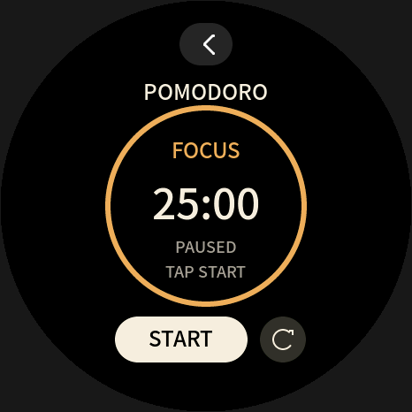
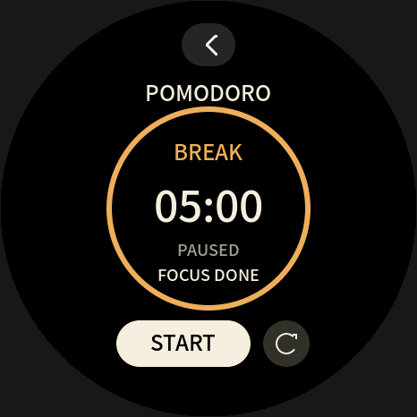

# Pomodoro

466×466 圆屏上的前台计时器：暖白大数字、琥珀色剩余进度环、下方胶囊开始/暂停与圆形重置。顶部返回区域由产品宿主拥有，应用不绘制或消费该热区；其他屏幕尺寸明确拒绝初始化。正式与 TEST 包版本均为 3。`RESET` 图形按钮始终回到工作阶段。`FOCUS DONE` / `BREAK DONE` 表示上一阶段完成、当前显示的下一阶段仍需手动开始。

前台工作 25 分钟、休息 5 分钟。屏幕下方左按钮开始/暂停，右按钮重置到工作阶段。工作结束进入休息并暂停；休息结束回工作并暂停。较大的时间跳变只切换一次，等待用户开始下一阶段。

## 圆屏预览

以下图片来自本示例实际 Wasm 输出，由 EEBadge 的生产 LVGL 绘制代码、实际字体和系统返回按钮渲染，并应用 466×466 圆形可视区域遮罩；不是设备照片。暖白数字、琥珀圆环和按钮布局为本示例绘制，没有使用第三方界面图片。

| 待开始 | 运行中 |
|---|---|
|  |  |
| 工作完成，休息待开始 | 退出后重新打开 |
|  |  |

顶部返回按钮由宿主绘制并负责停止应用；SDK 示例只保留相应空间。设计参考圆屏内容居中、边缘避免关键信息的原则：[Samsung 圆屏布局指南](https://developer.samsung.com/one-ui-watch-tizen/visual/layout.html)。

## 编译和打包

```powershell
python tools/tinyrt.py build examples/pomodoro --cc path/to/zig.exe
python tools/tinyrt.py pack examples/pomodoro --key path/to/application-signing.pem --key-id 100
```

从 SDK 根目录执行。正式应用 ID 为 `demo.pomodoro`；验收快进包独立 ID 为 `demo.pomodoro.fast`，清单标题与画面均明确标记 TEST 25s/5s，使用完全相同的计时逻辑：

```powershell
python tools/tinyrt.py build examples/pomodoro/app-fast.json --cc path/to/zig.exe
python tools/tinyrt.py pack examples/pomodoro/app-fast.json --development-key --key-id 1
```

## 保存和计时

使用 `uint32_t now_ms()` 的实际无符号差值计时，可跨一次计时器回绕；连续两次调度的间隔必须小于 2^32 ms。不会按 tick 次数累减。重新打开始终暂停，不把跨重启的单调时钟值当作截止时间。

KV key 0 的单个 i32 同时保存版本/配置标记、阶段、剩余毫秒。开始、暂停、重置、阶段切换各保存一次；运行时每满 60 秒保存一次检查点，100 个未跨检查点的 tick 不保存。非法版本、保留位或越界剩余时间回到有效的默认暂停状态。

支持本 SDK 新图形和可选 `tinyrt_stop()` 的宿主在正常退出时先结算最后一段毫秒差、暂停并保存，随后销毁实例；写入失败向宿主返回失败，继续保留原已提交存档。重新打开恢复暂停。强制断电、故障实例或未调用 stop 的宿主仍只能恢复最近检查点，正常调度下最多约丢失 60 秒；长时间未调度时丢失范围可更大。仅在前台计时，没有后台提醒、声音或振动。

## 验收状态

测试通过公开 ABI 驱动生产 C 与真实 Wasm，覆盖完整阶段、暂停/恢复/重置、非规则时间、回绕、检查点、正常 stop 与强制销毁的差别、写失败、坏档恢复及圆屏几何边界。每回调预算 100000、最大 2 页内存；详见 [tests/pomodoro](../../tests/pomodoro/README.md)。

本目录的主机测试不构成 BLE/设备实测证据。BLE 安装、设备重启、屏幕和物理触摸需在 EEBadge 产品验收中另行记录。
