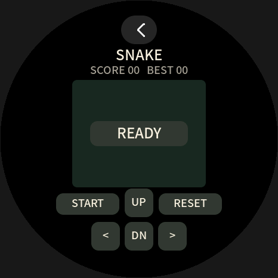
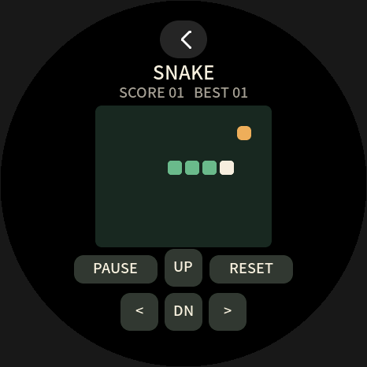
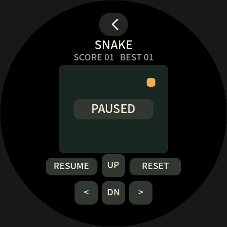
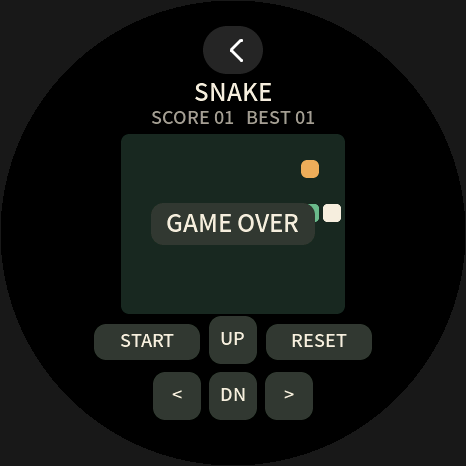
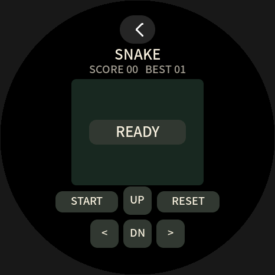
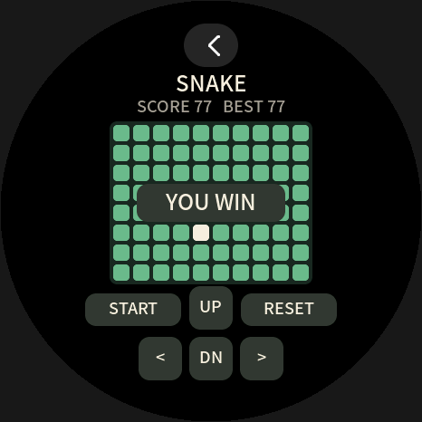

# Snake

可玩的 TinyRT ABI 1 贪吃蛇，面向 466×466 圆屏。白色蛇头、绿色蛇身、橙色食物；吃一个食物加 1 分，撞墙或身体结束，填满 80 格获胜。全部图形由 guest 绘制，不使用 ROM、图片资源或第三方游戏代码。

## 操作

仅使用触摸释放事件，按钮中心坐标如下。方向键在运行时生效，每次移动最多接受一次转向，直接反向无效。

| 控件 | 中心坐标 | 行为 |
|---|---|---|
| START / PAUSE / RESUME | `(147,342)` | 开始、暂停、继续；结束后 START 直接开始新局 |
| RESET | `(319,342)` | 回到 READY 等待开始，保留最高分 |
| UP | `(233,340)` | 向上 |
| `<` | `(177,396)` | 向左 |
| DN | `(233,396)` | 向下 |
| `>` | `(289,396)` | 向右 |
| 顶部宿主返回 | `(233,50)` | 由宿主正常停止应用并返回列表 |

棋盘为 10×8，每格 22px；蛇每 400ms 移动一格。时钟事件通常每 100ms 到达，应用根据实际毫秒差累计；每次回调最多移动两格，长延迟超过 800ms 时丢弃积压。暂停后继续重新等待完整 400ms。延迟到达的方向事件先推进已过去的时间，再改变下一步方向。READY、PAUSED 和 GAME OVER 状态下方向键不启动游戏。

## 构建和安装

在 SDK 根目录执行：

```powershell
python tools/tinyrt.py build examples/snake --cc path/to/zig.exe
python tools/tinyrt.py pack examples/snake --development-key --key-id 1
python tools/tinyrt.py validate examples/snake/build/demo.snake.trpkg --development-key --key-id 1
python tools/ble_install.py --address AA:BB:CC:DD:EE:FF --pair install examples/snake/build/demo.snake.trpkg
```

测试签名包 `demo.snake` 版本 1 使用公开开发密钥，设备必须显式信任 key ID 1，仅适合开发固件。包签名采用确定性 P-256；正式发布需另行提供自己的私钥与受信任 key ID。`validate` 仅验证信封，真实 Wasm 校验和运行测试见[测试说明](../../tests/snake/README.md)。

清单为 2 页线性内存上限、每回调 100000 指令、draw/input/storage/clock 权限。最满棋盘的获胜帧为 98 条绘制命令，低于宿主 128 条上限。所有非清屏命令的矩形边界位于中心 `(233,233)`、半径 215px 的安全圆内，顶部 `y=26..74` 留给宿主。

## 最高分存档

KV key 0 保存一个带版本标记的 i32：`0x53000000 | best`，有效最高分为 0..77；未知或损坏格式回到 0。只在最高分增长时调用 `kv_set`，普通移动、暂停、继续、重置不产生写入。正常 stop 推进最后已经过去的移动时间，并提交尚未保存的最高分；下次打开为新局 READY。

`kv_set` 成功表示交给宿主 KV，实际 Flash 持久化遵循宿主的写入节流和正常停止策略；突然断电可能丢失最近尚未持久化的最高分。guest 将存储失败返回宿主，不把失败声明为保存成功。这里不保存进行中的蛇身、方向或时钟。

## 验收路径与预览

从新存档开始，点击 START 后保持默认方向：约 1.2 秒时吃到第一颗食物，显示 `SCORE 01   BEST 01`；约 2.4 秒时撞右墙，显示 `GAME OVER`。点击 START 重开，RESET 回到 READY；正常返回后重新进入，应显示 `SCORE 00   BEST 01`。运行中点击方向键应转弯，PAUSE 后等待应不移动，RESUME 后继续。

以下 PNG 来自实际 WAMR 执行本目录 guest 后导出的帧，再由 EEBadge 生产 LVGL 绘制器、字体、宿主返回按钮和圆形遮罩渲染。它们是主机预览，不是设备实拍，也不替代真实触摸与 BLE 安装验收。

| 等待开始 | 运行 |
|---|---|
|  |  |

| 暂停 | 结束 |
|---|---|
|  |  |

| 重新打开 | 填满棋盘 |
|---|---|
|  |  |
